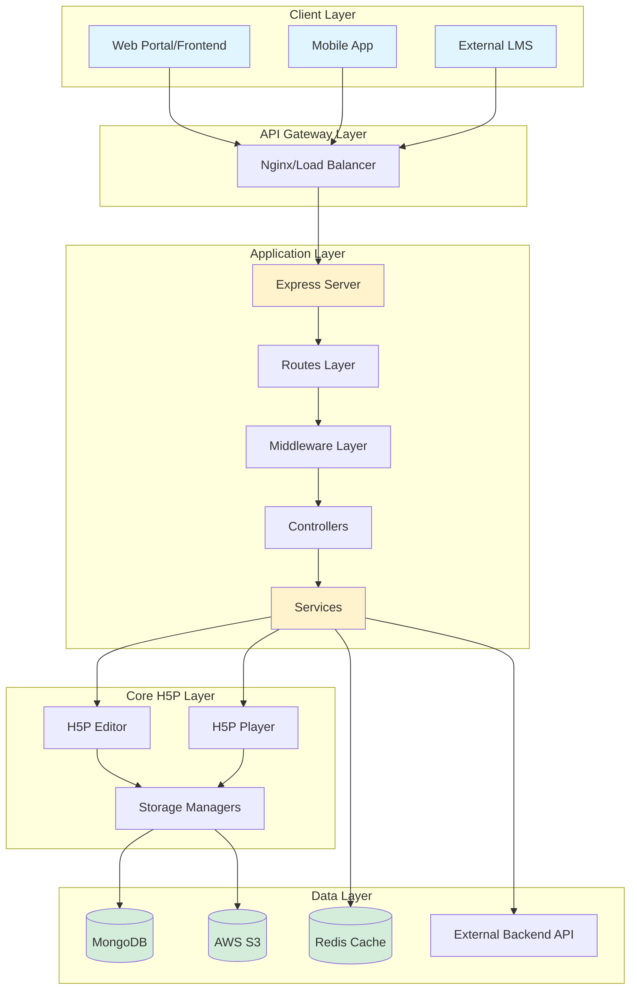
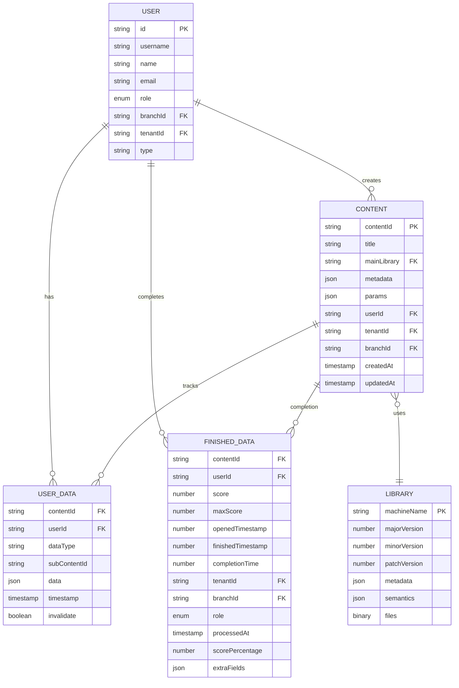
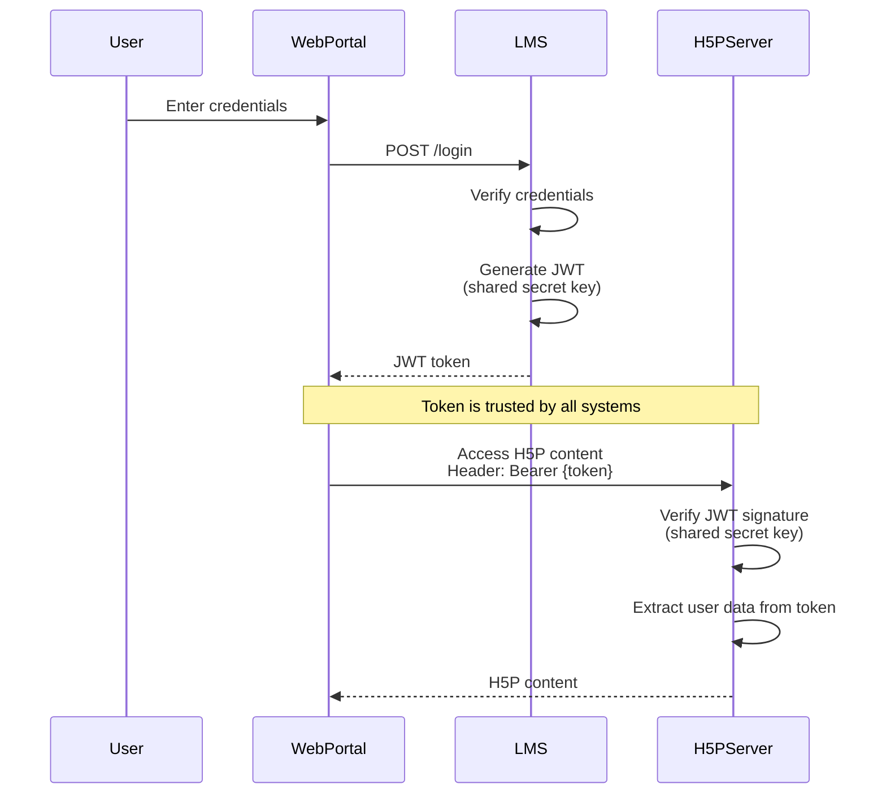
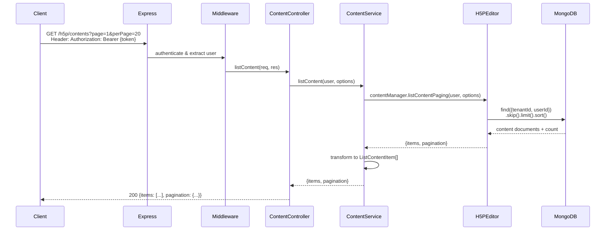
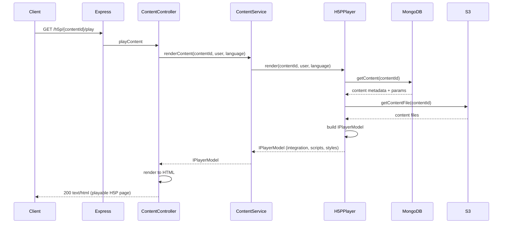
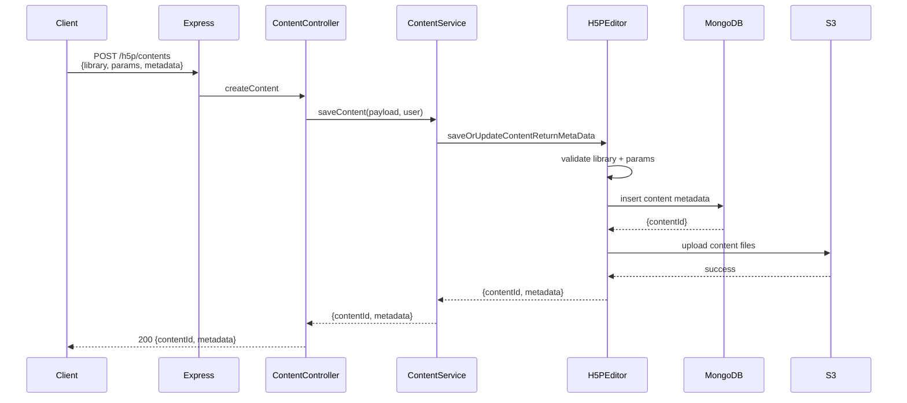
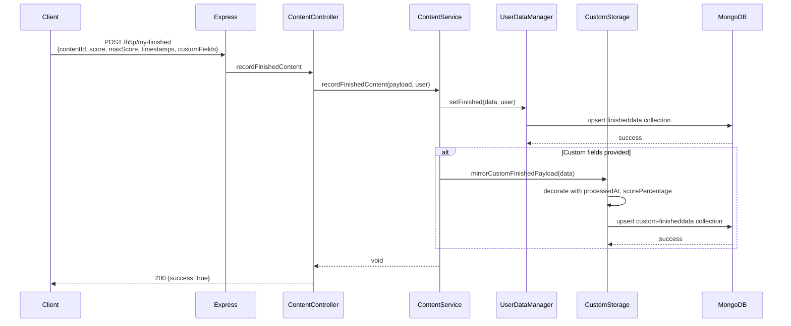
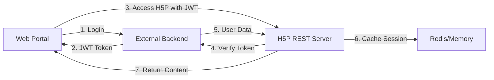

# H5P REST Server - Integration Guide

This document provides a comprehensive guide for integrating the `h5p-rest-server` into your existing projects, including architecture overview, sequence diagrams, database schemas, and step-by-step instructions.

---

## Table of Contents

1. [Architecture Overview](#architecture-overview)
2. [System Components](#system-components)
3. [Database Schema](#database-schema)
4. [Authentication Flow](#authentication-flow)
5. [Content Management Flow](#content-management-flow)
6. [Integration Steps](#integration-steps)
7. [External API Integration](#external-api-integration)
8. [Configuration Reference](#configuration-reference)

---

## Architecture Overview

The H5P REST Server follows a layered architecture pattern with clear separation of concerns:



### Key Features

- 🔐 **Shared Secret Key Auth**: Uses shared JWT secret key from LMS (local login disabled)
- 📦 **Scalable Storage**: MongoDB for metadata, S3 for content files
- ⚡ **Performance**: Redis caching for sessions and frequently accessed data
- 🌐 **i18n Ready**: Multi-language support via i18next
- 📝 **Auto-documented**: Swagger/OpenAPI documentation
- 🐳 **Container Ready**: Docker and docker-compose included

---

## System Components

### 1. Routes Layer

> **Note**: Local authentication routes (`/login`, `/logout`, `/sso/login`) are currently **disabled**. 
> The server uses a shared secret key from the LMS for JWT token verification.
> See [AUTHENTICATION.md](./AUTHENTICATION.md) for details.

```typescript
Routes
├── /auth/verify     - ✅ ACTIVE: External token verification (shared secret key)
└── /h5p/*          - ✅ ACTIVE: H5P content operations

// Disabled routes (commented out):
// ├── /login        - ❌ DISABLED: Local username/password authentication
// ├── /logout       - ❌ DISABLED: Token invalidation
// └── /sso/login    - ❌ DISABLED: Single sign-on with external user
```

### 2. Services Layer

| Service | Responsibility |
|---------|---------------|
| **AuthService** | User authentication, token management, session handling |
| **ContentService** | H5P content CRUD operations, editor/player rendering |
| **SessionCacheService** | In-memory session caching with TTL |
| **TokenVerificationService** | External API token verification |

### 3. Storage Layer

| Storage Type | Technology | Purpose |
|-------------|-----------|---------|
| **Content Storage** | MongoDB + S3 | H5P content metadata and files |
| **Library Storage** | MongoDB + S3 | H5P libraries |
| **User Data Storage** | MongoDB | User progress and xAPI statements |
| **Finished Data** | MongoDB | Custom completion tracking |
| **Session Cache** | Redis / In-Memory | Session and permission caching |

---

## Database Schema

### Entity Relationship Diagram



### MongoDB Collections

#### 1. **h5p-content** Collection

Stores H5P content metadata and parameters.

```typescript
{
  _id: ObjectId,
  contentId: string,        // Unique content identifier
  metadata: {
    title: string,
    authors: Array,
    license: string,
    mainLibrary: string,    // e.g., "H5P.InteractiveVideo"
    // ... other H5P metadata
  },
  params: {
    params: object,         // Content-specific parameters
    metadata: object
  },
  userId: string,           // Creator ID
  tenantId?: string,        // Multi-tenancy support
  branchId?: string,        // Organization/branch ID
  createdAt: Date,
  updatedAt: Date
}
```

**Indexes:**
- `{ contentId: 1, userId: 1 }`
- `{ tenantId: 1, createdAt: -1 }`
- `{ mainLibrary: 1 }`

#### 2. **userdata** Collection

Stores user interaction data and progress.

```typescript
{
  contentId: string,        // H5P content ID
  userId: string,           // User ID
  dataType: string,         // e.g., "state", "answered"
  subContentId?: string,    // Sub-content identifier
  data: object,             // xAPI statement or state data
  timestamp: number,
  invalidate: boolean
}
```

**Indexes:**
- `{ contentId: 1, userId: 1, dataType: 1, subContentId: 1 }`

#### 3. **finisheddata** Collection

Standard H5P completion tracking.

```typescript
{
  contentId: string,
  userId: string,
  score: number,
  maxScore: number,
  openedTimestamp: number,
  finishedTimestamp: number,
  completionTime: number
}
```

**Indexes:**
- `{ contentId: 1, userId: 1 }` (unique)

#### 4. **custom-finisheddata** Collection

Extended completion tracking with custom metadata.

```typescript
{
  contentId: string,
  userId: string,
  score: number,
  maxScore: number,
  openedTimestamp: number,
  finishedTimestamp: number,
  completionTime: number,
  role: ENUM_ROLE,          // User role at completion time
  branchId?: string,
  tenantId?: string,
  processedAt: number,      // Server processing timestamp
  scorePercentage: number,  // Calculated score percentage
  extraFields?: object      // Client-provided custom data
}
```

**Indexes:**
- `{ contentId: 1, userId: 1 }` (unique)
- `{ tenantId: 1, processedAt: -1 }`
- `{ branchId: 1, processedAt: -1 }`
- `{ processedAt: 1 }`

---

## Authentication Flow

> **Current Configuration**: The H5P server, LMS backend, and CMS backend all share the **same JWT secret key**. 
> Token verification is **not required** since all systems can decode and trust tokens signed with the shared secret.
> For full details, see [AUTHENTICATION.md](./AUTHENTICATION.md).

### Shared Secret Key Authentication

Since all backend systems (LMS, CMS, H5P Server) use the same JWT secret key, tokens generated by any system can be directly validated by other systems without additional verification calls.



### Authentication Configuration

All backend systems (LMS, CMS, H5P Server) must use the **same secret key**:

```env
# LMS Backend .env
JWT_SECRET_KEY=your-shared-secret-key-here

# CMS Backend .env
JWT_SECRET_KEY=your-shared-secret-key-here

# H5P Server .env
AUTH_JWT_ACCESS_TOKEN_SECRET_KEY=your-shared-secret-key-here
```

> **Note**: The `/auth/verify` endpoint may still exist but is **not required** for normal operation since all systems share the same secret key and can independently verify tokens.

### Disabled Authentication Flows

The following authentication methods are **currently disabled** (routes commented out in code):

- ❌ **Local Login** (`POST /login`) - Username/password authentication
- ❌ **Local Logout** (`POST /logout`) - Token invalidation
- ❌ **SSO Login** (`POST /sso/login`) - Single sign-on

To re-enable these, uncomment the routes in `src/routes/auth.routes.ts` and implement the necessary user storage.

---

## Content Management Flow

### 1. Content Listing Flow



### 2. Content Play Flow



### 3. Content Creation/Update Flow



### 4. Learner Progress Tracking Flow



---

## Integration Steps

### Step 1: Prerequisites

Ensure you have the following installed:

- Node.js ≥ 16.x
- MongoDB ≥ 4.4
- Redis ≥ 6.x (optional, for caching)
- AWS S3 bucket or S3-compatible storage
- Docker (optional, for containerized deployment)

### Step 2: Installation

#### Option A: Standalone Installation

```bash
# Clone the repository
git clone https://github.com/Lumieducation/H5P-Nodejs-library.git
cd H5P-Nodejs-library

# Install dependencies
npm install

# Navigate to h5p-rest-server
cd packages/h5p-rest-server

# Copy environment template
cp .env.example .env
```

#### Option B: Add as Package Dependency

```bash
# Add to your project
npm install @lumieducation/h5p-rest-server

# Or with workspace (monorepo)
# Add to packages/ directory and link via workspaces
```

### Step 3: Environment Configuration

Edit `.env` file with your configuration:

```env
# ===== STORAGE CONFIGURATION =====

# MongoDB
MONGODB_URL=mongodb://localhost:27017
MONGODB_DB=h5p
MONGODB_USER=root
MONGODB_PASSWORD=yourpassword

# AWS S3
AWS_ACCESS_KEY_ID=your-access-key
AWS_SECRET_ACCESS_KEY=your-secret-key
AWS_REGION=ap-southeast-1
AWS_S3_ENDPOINT=https://s3.amazonaws.com
AWS_S3_MAX_FILE_LENGTH=100

# Content Storage
CONTENTSTORAGE=mongos3
CONTENT_AWS_S3_BUCKET=h5p-content
CONTENT_MONGO_COLLECTION=h5p-content

# Temporary Files
TEMPORARYSTORAGE=s3
TEMPORARY_AWS_S3_BUCKET=h5p-temp-content

# User Data
USERDATASTORAGE=mongo
USERDATA_MONGO_COLLECTION=userdata
FINISHED_MONGO_COLLECTION=finisheddata

# ===== AUTHENTICATION =====

# JWT Configuration
AUTH_JWT_ACCESS_TOKEN_SECRET_KEY=your-super-secret-key-change-this
AUTH_JWT_ACCESS_TOKEN_EXPIRED=7d
AUTH_JWT_REFRESH_TOKEN_SECRET_KEY=another-secret-key-change-this
AUTH_JWT_REFRESH_TOKEN_EXPIRED=30d

# ===== EXTERNAL API INTEGRATION =====

# External Backend (for SSO/Token Verification)
EXTERNAL_API_URL=https://your-backend-api.com
EXTERNAL_API_VERIFY_ENDPOINT=/auth/verify
EXTERNAL_API_TIMEOUT=5000

# Session Cache
SESSION_CACHE_TTL_MS=300000  # 5 minutes

# ===== OPTIONAL =====

# Redis Cache
CACHE=redis
REDIS_HOST=localhost
REDIS_PORT=6379
REDIS_DB=0

# Redis Lock
LOCK=redis
LOCK_REDIS_HOST=localhost
LOCK_REDIS_PORT=6379
LOCK_REDIS_DB=1

# Internationalization
I18N_PRELOAD_LANGUAGES=en,vi,zh

# Debug
DEBUG=h5p:*
LOG_LEVEL=debug
```

### Step 4: Database Setup

The server will automatically create collections and indexes on first run. However, you can run manual setup:

```bash
# Start MongoDB
mongod --dbpath /path/to/data

# (Optional) Run migration scripts if provided
npm run db:migrate
```

### Step 5: Download H5P Core Assets

```bash
# From packages/h5p-rest-server directory
npm run download:core
```

This downloads the H5P core library files (JavaScript, CSS) needed for the editor and player.

### Step 6: Start the Server

#### Development Mode

```bash
npm run start:dev
```

The server will run on `http://localhost:8080` with hot-reload enabled.

#### Production Mode

```bash
npm run build
npm start
```

### Step 7: Docker Deployment (Optional)

```bash
# Build Docker image (from repository root)
docker build -f packages/h5p-rest-server/Dockerfile -t h5p-rest-server:latest .

# Run container
docker run --env-file packages/h5p-rest-server/.env \
  -v h5p_data:/app/packages/h5p-rest-server/h5p \
  -p 8080:8080 \
  h5p-rest-server:latest

# Or use docker-compose
cd packages/h5p-rest-server
docker-compose up -d
```

### Step 8: Verify Installation

1. **Check API Health**: Visit `http://localhost:8080/docs` for Swagger UI
2. **Authentication Test**:

```bash
# Local login (requires seeded users or custom implementation)
curl -X POST http://localhost:8080/login \
  -H "Content-Type: application/json" \
  -d '{"username": "admin", "password": "password"}'
```

3. **SSO Test**:

```bash
curl -X POST http://localhost:8080/sso/login \
  -H "Content-Type: application/json" \
  -d '{
    "user": {
      "username": "user1",
      "name": "Test User",
      "role": "SUPER_ADMIN"
    },
    "tenantId": "tenant-1",
    "branchId": "branch-1"
  }'
```

---

## External API Integration

### Token Verification Endpoint

Your external backend should provide a token verification endpoint:

```typescript
// External API: GET /auth/verify
// Headers: Authorization: Bearer {token}

// Expected Response:
{
  "statusCode": 200,
  "data": {
    "id": "user-uuid",
    "username": "user@example.com",
    "email": "user@example.com",
    "role": "SUPER_ADMIN",
    "tenantId": "tenant-123",
    "branchId": "branch-456"
  }
}
```

### Integration Flow



### Client Integration Example

```typescript
// Frontend login flow
async function login(username: string, password: string) {
  // Step 1: Login to external backend
  const response = await fetch('https://your-backend.com/auth/login', {
    method: 'POST',
    headers: { 'Content-Type': 'application/json' },
    body: JSON.stringify({ username, password })
  });
  
  const { token } = await response.json();
  
  // Step 2: Verify token with H5P server
  const verifyResponse = await fetch('http://h5p-server:8080/auth/verify', {
    method: 'POST',
    headers: { 'Authorization': `Bearer ${token}` }
  });
  
  const { user } = await verifyResponse.json();
  
  // Step 3: Store token and make H5P requests
  localStorage.setItem('authToken', token);
  
  // Now you can access H5P endpoints
  await fetchH5PContent(token);
}

async function fetchH5PContent(token: string) {
  const response = await fetch('http://h5p-server:8080/h5p/contents', {
    headers: { 'Authorization': `Bearer ${token}` }
  });
  
  const { items } = await response.json();
  return items;
}
```

---

## Configuration Reference

### Storage Options

| Option | Values | Description |
|--------|--------|-------------|
| `CONTENTSTORAGE` | `mongos3`, `mongo`, `s3`, `file` | Where to store H5P content |
| `LIBRARYSTORAGE` | `mongos3`, `mongo`, `s3`, `file` | Where to store H5P libraries |
| `TEMPORARYSTORAGE` | `s3`, `file` | Where to store temporary files |
| `USERDATASTORAGE` | `mongo` | Where to store user progress data |

### Cache Options

| Option | Values | Description |
|--------|--------|-------------|
| `CACHE` | `redis`, `memory` | Cache provider |
| `LOCK` | `redis` | Distributed lock provider |

### Security Best Practices

1. **Use Strong JWT Secrets**: Generate random, long secrets for production
2. **Enable HTTPS**: Always use TLS in production
3. **Rate Limiting**: Implement rate limiting on authentication endpoints
4. **CORS Configuration**: Restrict CORS to your frontend domains
5. **Environment Variables**: Never commit `.env` to version control
6. **Token Expiration**: Use short-lived access tokens (15m - 1h)
7. **Refresh Tokens**: Implement refresh token rotation

### Performance Tuning

1. **Redis Caching**: Enable Redis for session caching in production
2. **CDN for Assets**: Serve H5P core assets via CDN
3. **MongoDB Indexes**: Ensure all collections have proper indexes
4. **Connection Pooling**: Configure MongoDB connection pool size
5. **Upload Limits**: Adjust `AWS_S3_MAX_FILE_LENGTH` based on your needs

---

## Troubleshooting

### Common Issues

**1. MongoDB Connection Refused**

```bash
# Check MongoDB is running
mongosh mongodb://localhost:27017

# Check credentials in .env
MONGODB_USER=root
MONGODB_PASSWORD=yourpassword
```

**2. S3 Upload Fails**

```bash
# Verify AWS credentials
aws s3 ls s3://your-bucket-name

# Check bucket permissions and CORS settings
```

**3. Token Verification Fails**

```bash
# Test external API manually
curl -H "Authorization: Bearer {token}" \
  https://your-backend.com/auth/verify

# Check EXTERNAL_API_URL in .env
```

**4. H5P Core Assets Not Found**

```bash
# Re-download H5P core
npm run download:core

# Check h5p/ directory exists
ls -la packages/h5p-rest-server/h5p
```

---

## API Reference

For detailed API documentation, run the server and visit:

**Swagger UI**: `http://localhost:8080/docs`

**OpenAPI JSON**: `http://localhost:8080/docs/json`

---

## Support & Contributing

- **Issues**: [GitHub Issues](https://github.com/Lumieducation/H5P-Nodejs-library/issues)
- **Discussions**: [GitHub Discussions](https://github.com/Lumieducation/H5P-Nodejs-library/discussions)
- **Slack**: [Lumi Education Slack](https://join.slack.com/t/lumi-education/shared_invite/...)

---

## License

GNU General Public License v3.0 - See [LICENSE](../../../LICENSE) file for details.
